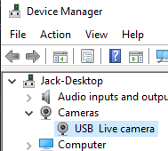

This python script can be run on any computer with internet and a camera device. It will eventually also have the motor-control code for our RC car, but for now it simply opens a websocket server and accepts offers for WebRTC streaming (using the websocket connection for signalling).

## Install

Clone the repo and run these commands in the project directory:

```
python -m venv venv

# windows:
.\venv\Scripts\activate

# mac/linux:
source ./venv/bin/activate

pip install -r requirements.txt
```

## Run

### Windows-Specific

For now, if you're using Windows you'll need to hardcode the camera device name. Plug your USB camera in and open device manager to find the name:



Then edit the top of `main.py` like so (note that my camera name had 2 spaces for some reason):

```py
WINDOWS_CAMERA_NAME = "USB  Live camera"
```

### Start

In the project directory, run

```
python main.py
```
